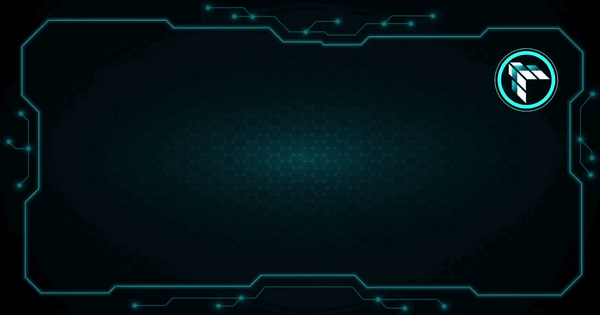
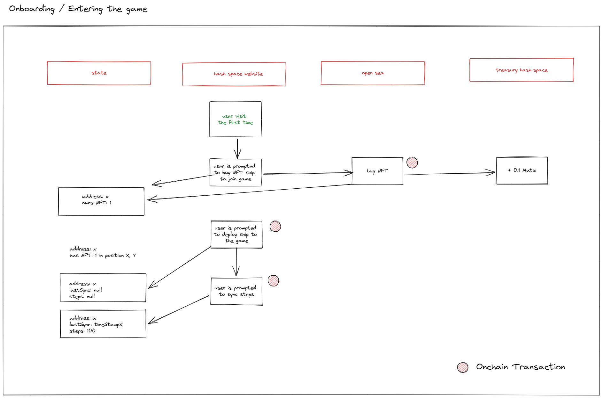
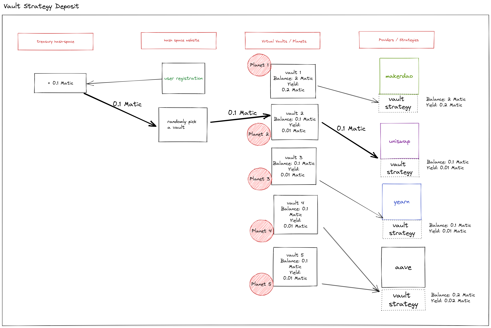
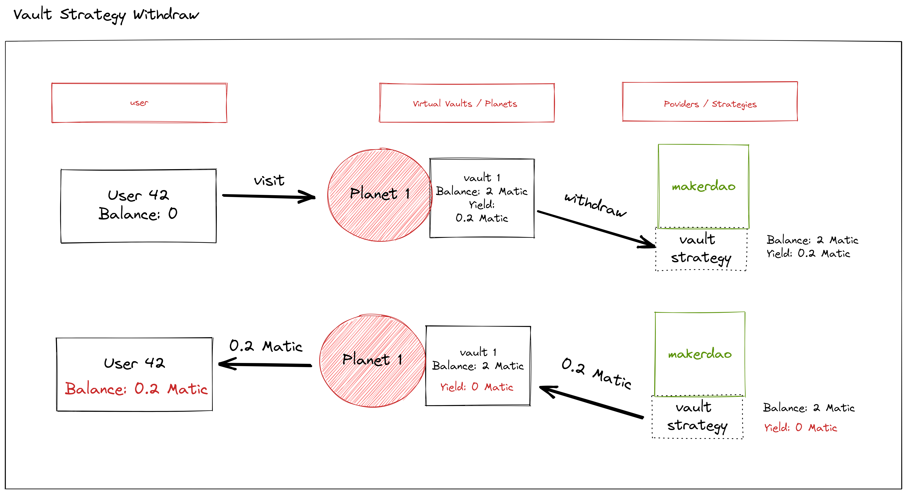

# Hash Space

Hash Space is a DeFi product discovery game where players explore a galaxy of defi planets, get yield bounties, flying around in a spaceship powered with footsteps.

[](https://github.com/RichardLitt/standard-readme)



## Table of Contents

- [About](#about)
- [Install](#install)
- [How It's Made](#how-its-made)
- [How It Works](#how-it-works)
- [Team and Context](#team-and-context)

## About

Hash Space is a DeFi product discovery that makes it fun for players to learn and test out new DeFi products, solutions, protocols. We are taking DeFi product discovery to a whole new level of fun for players, while creating a completely new channel of customer acquisition for DeFi product creators.

Right now, it’s hard for new users to know what DeFi products are out there for them. It’s harder to try before they buy in to a particular solution without upfront cost and complexity. It’s even harder to be rewarded easily for this exploration and testing.

Hash Space combines HealthFi, DeFi, and GameFi.

1. HealthFi: You explore the galaxy in your spaceship - powering it with your real steps. This promotes healthy habits.
2. DeFi product discovery: The planets that you travel to are actually yield generating vaults - getting earning from DeFi protocols. Different types of planets represent different types of DeFi products, protocols, solutions. Players learn about the different options when they explore the planets.
3. GameFi: When you arrive at a planet you get the yield from that vault as your bounty! Or you might get nothing if another player has already beat you to it.

Let’s find out “what’s out there” in the DeFi galaxy!

## Install

```sh
git clone https://github.com/hash-space/hash-space/
cd hash-space
```

#### Install packages

```sh
npm install
```

#### Deploy contracts

In one terminal:

```sh
npm run node
```

In another terminal, to deploy on local host::

```sh
npm run deploy:local
```

Or to deploy on Polygon Mumbai / Oasis Emerald Testnet / Arbitrum Nitro, use one of the following:

```sh
npm run deploy:mumbai
npm run deploy:emerald-test
npm run deploy:arbitrum-nitro
```

#### Run front-end

```sh
npm run dev
```

## How it's made

Our smart contracts were created and deployed using hardhat, with scaffold-eth, chai and waffle used for testing. The primary contracts are for (1) creating planets, (2) defining the world (which inherits the ability to create planets), (3) creating player profiles and and moving their starships and (4) creating NFT starships and tracking their position. All contracts are written in solidity and deployed across Polygon Mumbai, Oasis Emerald Testnet and Arbitrum Nitro. The NFTs are ERC721, and the image and metadata are stored using NFT.storage. The Open Zeppelin SDK is used to define the NFTs.

Each planet type is backed by vaults with different yield-generating protocols. We created integrations using the yearn vaults using the yearn baseStrategy standard and APWine using their SDK and tutorial script. We also attempted the integrations with MakerDAO, Uniswap and Aave.

The front-end is build using a combination of nextJS and reactJS, with a mix of TypeScript and JavaScript. Wallet connection is mediated via a web3modal, which offers Metamask, Wallet Connect, Coinbase Wallet and (not yet fully functional) Unstoppable Domains. Game registration and NFT minting is called from the front-end. Steps are imported into the game via a back-end query to the Google Fit API (enabled by an oauth2 Client). The game itself uses the PIXI js as game-engine to enable movement of ships and rendering of effects and graphics. Finally, we have an EPNS channel to serve users with updates on game events.

We make heavy use of github actions to automate deployments of smart contracts to the different chains and running of tests. This allows us to iterate fast and build things in parallel at ease.

## How it works

1. Players join by connecting their wallet and their smart device which can measure their footsteps
2. Upon registration, players buy a Ship NFT from OpenSea. This money goes into the treasury.
3. The treasury is deployed towards the featured or partner DeFi protocols. Earning yield through their product mechanism.
4. When a player lands on a planet - they are given information to learn about the protocol on that planet.
5. If any yield is present on that planet, then the player can take this as their bounty reward.
6. Unless another player has already beaten them to it and taken the reward before them.
7. New yield from the treasury’s earnings is added to the planets at regular intervals.





## Team and Context

This project was a collaborative effort between:

- Manuel Villing
- Chris Lovejoy
- Dhruv Malik
- Ali Rizvi
- Ignacio Pastor

This game was initially built as part of the [ETH Global Hack Money Hackathon 2022](https://showcase.ethglobal.com/hackmoney2022/hash-space-fjy9k).
